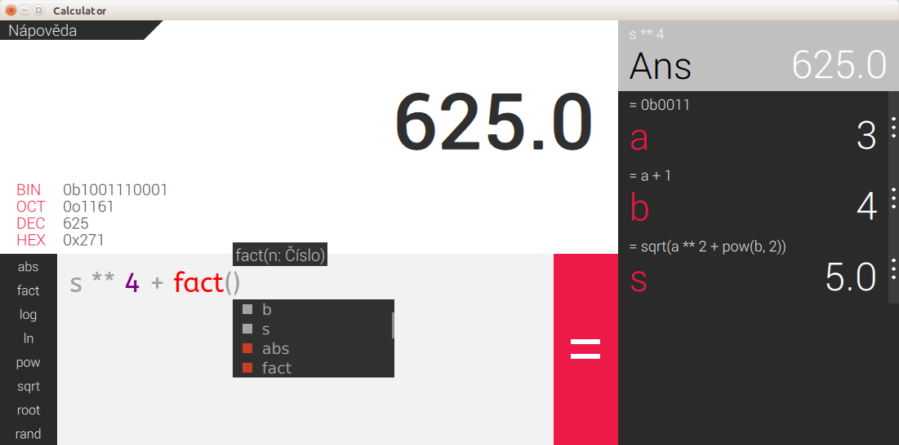

# IVS-VUT-BIT-2016-2017

[](https://travis-ci.com/thejoeejoee/IVS-VUT-BIT-2016-2017)
[](https://app.codeship.com/projects/211472)
[](https://codecov.io/gh/thejoeejoee/IVS-VUT-BIT-2016-2017)
[](https://www.gnu.org/licenses/gpl-3.0.en.html)

Grafická kalkulačka jako školní projekt do předmětu IVS na FIT VUT v letním semestru školního roku 2016/2017. Kalkulačka nabízí plnohodnotné matematické funkce, systém proměnných (včetně jejich zavislostí) i skrytý easter egg.

Tutoriálem k aplikaci a postupy pro **instalaci** naleznete v [uživatelské dokumentaci](./doc/doc.md).

Rozhraní kalkulačky
-------------------


Vývoj
-----
Testovací skripty spustíme příkazem
```
make test
```

Po každém commitu se aplikace sestaví a otestuje pomocí systémů [Travis-CI](https://travis-ci.com/) a [Codeship](https://codeship.com/).
Pomocí příkazu `make` lze také zkompilovat QML a přiložené zdroje, či nainstalovat závislosti aplikace viz. Makefile.

Prostředí
---------
Ubuntu 64bit

Autoři
------

/dej/uran/dom
- xkolar71 Josef Kolář
- xnguye16 Son Hai Nguyen
- xomach00 Martin Omacht
- xnavra61 Robert Navrátil

Licence
-------

Tento program je licenován pod licencí GNU GPL Version 3.
