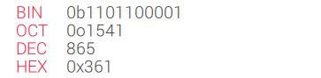
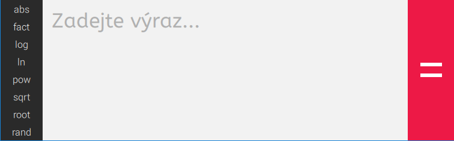

# IVS-VUT-BIT-2016-2017 
# **Calculator - Uživatelská dokumentace**

## **Obsah**

* [Úvod](#úvod)
* [Instalace](#instalace) 
* [Odinstalace](#odinstalace)
* [Matematické funkce](#matematické-funkce)
* [Tutorial](#tutorial)
  * [Komponenty](#komponenty)
  * [Práce s kalkulačkou](#práce-s-kalkulačkou)

## **Úvod**

Tato aplikace představuje klasickou kalkulačku se speciálními funkcemi. Jádro Calculatoru je napsáno v [Pythonu](https://www.python.org/).  

## **Instalace**

Aplikaci je možnost nainstalovat buď jako instalační balíček operačního systému Debian stáhnutelný z [posledního vydání](https://github.com/thejoeejoee/IVS-VUT-BIT-2016-2017/releases/latest) aplikace - instalace pak probíhá následovně:
```
// instalace balíku
# dpkg -i python3-calculator_XXX.deb
// doinstalace jeho závislostí
# apt install -f
```
Alternativní cestou instalace je instalace jako standardní balíček jazyka Python pomocí skriptu `setup.py` v kořenu repozitáře aplikace:
```
$ git clone https://github.com/thejoeejoee/IVS-VUT-BIT-2016-2017.git calculator
$ cd calculator
$ python3 setup.py install
```
V obou případech je do systému nainstalována grafický spouštěč, hledejte v menu vašeho systému. Také jsou nainstalovány spustitelné programy `calculator`, `calculator-console`, z niž první spouští grafické rozhraní aplikace, druhý pouze konzolovou verzi kalkulačky. 

## **Odinstalace**

Zde záleží, kterým způsobem byla kalkulačka nainstalována - jestliže jako balíček operačního systému Debian, pak pomocí standardního balíčkovacího systému `apt`:
```
# apt remove python3-calculator
```
V případě instalace jako Python balíček (požadována Python utilita `pip3` pro správu balíčků):
```
# pip3 uninstall calculator
```

## **Matematické funkce**

Ve všech funkcích jdou použít klasické operátory (+, -, *, /) a i jiné funkce.

<br>
|Zápis|Význam|Poznámka|
|-----|------|--------|
|abs(x)<br>\|x\| |Funkce pro výpočet absolutní hodnoty zadaného čísla.| |
|fact(x)<br>x! |Výpočet faktorialu zadaného čísla.|Hodnota faktorialu je kvůli prudkému nárustu omezena.|
|ln(x) |Funkce počítá přirozený logaritmus čísla 'x'.|Přirozený logaritmus má základ 'e' (Eulerovo číslo).|
|log(x,y) |Výpočet obecného logaritmu se zadaným základem.|x = logaritmované číslo<br>y = základ logaritmu|
|pow(x,y)<br>x**y |Funkce pro výpočet mocniny.|x = mocněné číslo (mocněnec)<br>y = mocnitel|
|rand() |Funkce, která vygeneruje náhodné reálné číslo.|Funkce nemá žádný parametr.|
|root(x,y) |Funkce pro výpočet obecné odmocniny.|x = odmocňované číslo<br>y = y-tá odmocnina|
|sqrt(x) |Funkce pro výpočet 2. odmocniny.| |
<br>

## **Tutorial**

V této kapitole bude popsána práce v Calculator, jeho funkce a užitečné vlastnosti, a dále také základní panely pro práci.

### Komponenty

#### Číselné soustavy

Pokud je výsledek _celočíselný_, tak bude výsledek převeden a zobrazen ve 4 číselných soustavách (dvojkové, osmičkové, desítkové, šestnáctkové). Velký výsledek, který se nevyobrazí celý v okně je možné zobrazit pomocí posuvníku.



#### Funkce a zápisové okno

Jednou z hlavních částí je panel s funkcemi a k němu navazující okno s výrazem k výpočtu.



#### Proměnné

Calculator umí také používat proměnné, takže si můžete uložit výpočty do proměnných a dále je používat. Panel proměnných obsahuje také posuvník, pokud je proměnných příliš mnoho.

Dávejte si ale pozor na to, že proměnné jsou **case sensitive**.


Pro identifikátor můžete použít jakýkoliv UNICODE znak, který neodporuje běžným matematickým konstrukcím a znakům jako uvozovky apod.

### Práce s kalkulačkou

**Calculator** obsahuje funkce, které Vám mohou zrychlit práci. Jednou z těchto funkcí je doplňování kódu klávesovou zkratkou `ctrl+space`. Toto menu obsahuje všechny proměnné i funkce.


Dále také rozšíření závorek a výrazů do funkcí. Výraz, který chcete vložit do funkce nebo závorek označíte a kliknete na funkci nebo napíšete levou závorku `(`.


Také je třeba zmínit práci s proměnnými. Proměnné lze mazat v menu (tři tečky) pomocí ikony koše, a také nastavit na `1` nebo `0`. Pravým kliknutím myši se Vám do výrazového okna zkopíruje hodnota proměnné a levým kliknutím myši její identifikátor.


Calculator má také vestavěnou nápovědu funkcí.

PICTURE

Poslední věcí je zápis v různých soustavách, který se provádí pomocí prefixů:
* `0b[číslo]` pro dvojkovou soustavu
* `0o[number]` pro osmičkovou soustavu
* `0x[number]` pro šestnáctkovou soustavu


