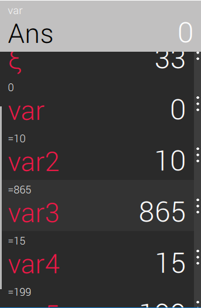

# IVS-VUT-BIT-2016-2017 
# **Barbie calculator - Uživatelská dokumentace**

## **Obsah**

* [Úvod](#úvod)
* [Instalace](#instalace) 
* [Odinstalace](#odinstalace)
* [Matematické funkce](#matematické-funkce)
* [Tutorial](#tutorial)
  * [Komponenty](#komponenty)
  * [Práce s kalkulačkou](#práce-s-kalkulačkou)

## **Úvod**

Tato aplikace představuje klasickou kalkulačku se speciálními funkcemi. Jádro Barbie calculatoru je napsáno v [Pythonu](https://www.python.org/).  

## **Instalace**

## **Odinstalace**

## **Matematické funkce**

Ve všech funkcích jdou použít klasické operátory (+, -, *, /) a i jiné funkce.
 
<table style="width: 100%;">
	<tr>
		<th style="background-color: lightgrey;">Zápis</th>
		<th style="background-color: lightgrey;">Význam</th>
		<th style="background-color: lightgrey;">Poznámka</th> 
	</tr>
	<tr>
		<td style="background-color: white;">abs(x)</td>
		<td rowspan="2" style="background-color: white;">Funkce pro výpočet absolutní hodno- ty zadaného čísla</td>
		<td rowspan="2" style="background-color: white;"></td>
	</tr>
	<tr>
		<td>|x|</td>
	</tr>
	<tr>
		<td style="background-color: white;">fact(x)</td>
		<td rowspan="2" style="background-color: white;">Výpočet faktorialu zadaného čísla</td>
		<td rowspan="2" style="background-color: white;"> Hodnota faktorialu je kvůli prudkému nárustu omezena.</td>
	</tr>
	<tr>
		<td>x!</td>
	</tr>
	<tr>
		<td>ln(x)</td>
		<td>Funkce počítá přirozený logaritmus čísla 'x'</td>
		<td>Přirozený logaritmus má základ 'e' (Eulerovo číslo)</td>
	</tr>
	<tr>
		<td>log(x,y)</td>
		<td>Výpočet obecného logaritmu se zada- ným základem</td>
		<td>x = logaritmované číslo y = základ logaritmu
	</tr>
	<tr>
		<td>pow(x,y)</td>
		<td rowspan="2">Funkce pro výpočet mocniny</td>
		<td rowspan="2">x = mocněné číslo (mocněnec) y = mocnitel</td>
	</tr>
	<tr>
		<td>x**y</td>
	</tr>
	<tr>
		<td>rand()</td>
		<td>Funkce, která vygeneruje náhodné reálné číslo</td>
		<td>Funkce nemá žádný parametr</td>
	</tr>
	<tr>
		<td>root(x,y)</td>
		<td>Funkce pro výpočet obecné odmocni- ny</td>
		<td>x = odmocňované číslo y = y-tá odmocnina</td>
	</tr>
	<tr>
		<td>sqrt(x)</td>
		<td>Funkce pro výpočet 2. odmocniny</td>
		<td></td>
	</tr>
</table>

## **Tutorial**

V této kapitole bude popsána práce v Barbie calculator, jeho funkce a užitečné vlastnosti, a dále také základní panely pro práci.

*Okno programu má pevně nastavený poměr stran*.

### Komponenty

#### Číselné soustavy

Pokud je výsledek _celočíselný_, tak bude výsledek převeden a zobrazen ve 4 číselných soustavách (dvojkové, osmičkové, desítkové, šestnáctkové). Velký výsledek, který se nevyobrazí celý v okně je možné zobrazit pomocí posuvníku.

#### Funkce a zápisové okno

Jednou z hlavních částí je panel s funkcemi a k němu navazující okno s výrazem k výpočtu.

#### Proměnné

Barbie calculator umí také používat proměnné, takže si můžete uložit výpočty do proměnných a dále je používat. Panel proměnných obsahuje také posuvník, pokud je proměnných příliš mnoho.

Dávejte si ale pozor na to, že proměnné jsou **case sensitive**.

Pro identifikátor můžete použít jakýkoliv UNICODE znak, který neodporuje běžným matematickým konstrukcím a znakům jako uvozovky apod.

### Práce s kalkulačkou

**Barbie calculator** obsahuje funkce, které Vám mohou zrychlit práci. Jednou z těchto funkcí je doplňování kódu klávesovou zkratkou `ctrl+space`. Toto menu obsahuje všechny proměnné i funkce.

Dále také rozšíření závorek a výrazů do funkcí. Výraz, který chcete vložit do funkce nebo závorek označíte a kliknete na funkci nebo napíšete levou závorku `(`.

Poslední věc, kterou je potřeba zmínit je práce s proměnnými. Proměnné lze mazat v menu (tři tečky) pomocí ikony koše, a také nastavit na `1` nebo `0`. Pravým kliknutím myši se Vám do výrazového okna zkopíruje hodnota proměnné a levým kliknutím myši její identifikátor.

